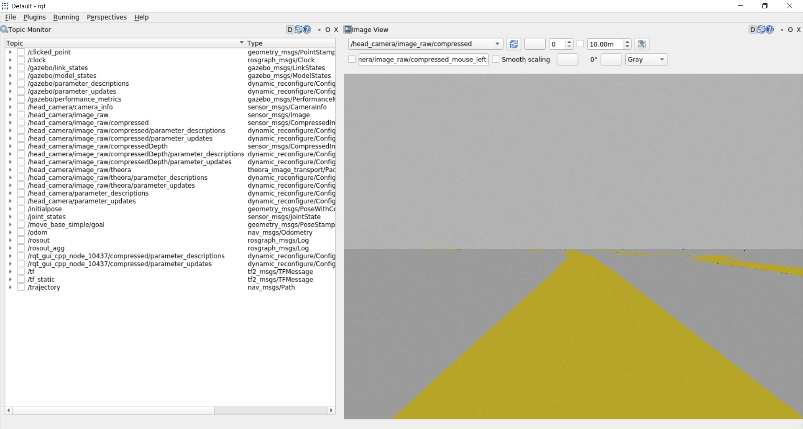

[//]: # (Image References)

[image1]: ./assets/race_car_cad.png "Race car"
[image2]: ./assets/track_cad.png "Monaco track"
[image3]: ./assets/gazebo_model_tree.png "Gazebo model - Monaco"
[image4]: ./assets/Gazebo_sim.png "Gazebo szimuláció"
[image5]: ./assets/rqt_cam.png "Kamera kép - rqt"

# Robotrendszerek laboratórium projekt feladat
Robotrendszerek laboratórium tárgynak féléves projekt feladata, ahol ROS Noetic környezetben fejlesztettünk egy mobil robotot.

# Vonalkövető versenyautó programozása
A sikeres telepítéshez és futtatáshoz szükséges fontosabb lépések:

# Tartalomjegyzék
1. [Telepítési útmutató](#Telepítési-útmutató)
2. [Versenyautó megtervezése](#Versenyautó-megtervezése)
3. [Versenypálya](#Versenypálya)
4. [Gazebo szimuláció](#Gazebo-szimuláció)
5. [Alaklmazott szenzorok](#Alaklmazott-szenzorok)  
5.1. [Kamera](#Kamera)
6. [Skid steer kormányzás](#Skid-steer-kormányzás)
7. [Képfeldolgozás OpenCV-vel](#Képfeldolgozás-OpenCV-vel])
8. [Szimuláció futtatása](#Szimuláció-futtatása)


# Telepítési útmutató


# Versenyautó megtervezése
A versenyautó tervezésnék ötletét internetes forrásból vettem, ami egy kis lego kocsi, amit Solidworks-ben az egyszerűbb kezelhetőség érdekében módosítottam.

  ![alt text][image1]

Ezekután blenderben beállítottam a megfelelő színeket, majd exportáltam egyenként a mozgó komponenseket. A mobil robot vázát illetve a szimulációhoz szükséges paraméterek beállítását a `mogi_bot.xacro` fájlban tettük meg, a robot irányításáért és a kamera képért felelős gazebo plug-in-ket a `mogi_bot.gazebo` fájlban adtuk hozzá.

# Versenypálya
A versenypályát szintén Solidworks-ben egy letöltött, és importált kép segítségével terveztem meg, aminek kontúrját körberajzoltam Besier görbékkel, és kiexportáltam egy `.stl` fájlt.

A pálya kontrúja

  ![alt text][image2] 

Blenderbe beimportálva készítettem egy a gazebo által is kezelhető collada mesht, ami tartalmazza a blenderben beállított színeket is. Ahhoz, hogy a Gazebo megnyitáskor lássa a modellt, az alábbi sort kell a `.bashrc`-hez hozzá adni.

```console
export GAZEBO_MODEL_PATH=$GAZEBO_MODEL_PATH:~/bme_catkin_ws/src/ROS_HW_23_24/gazebo_models
```

# Gazebo szimuláció

A versenyautó és pálya megjelenítése a szimulációban. A szimuláció elindításához egy `.world` kiterejesztésű fájlra van szükségünk, ami tartalmazza a világ, szimulációhoz szükséges fizikai beállításait, valamint a hozzáadott további modelleket.


  ![alt text][image4]


A kocsi beimportálása a világba a `spawn_robot.launch` fájl elindításával történik, ahol argumentumként a robot kezdeti pozícióját megadhatjuk.

# Alkalmazott szenzorok
A képfeldogozáshoz egy kamera került elhelyezésre a versenykocsi elején, aminek paramétereit az órán használtak alapján állítottuk be.

## Kamera

  A kamerát az alábbi plugin valósítja meg. 
  ```xml
  <plugin name="camera_controller" filename="libgazebo_ros_camera.so">
    <alwaysOn>true</alwaysOn>
    <updateRate>0.0</updateRate>
    <cameraName>head_camera</cameraName>
    <imageTopicName>image_raw</imageTopicName>
    <cameraInfoTopicName>camera_info</cameraInfoTopicName>
    <frameName>camera_link_optical</frameName>
    <hackBaseline>0.07</hackBaseline>
    <distortionK1>0.0</distortionK1>
    <distortionK2>0.0</distortionK2>
    <distortionK3>0.0</distortionK3>
    <distortionT1>0.0</distortionT1>
    <distortionT2>0.0</distortionT2>
  </plugin>
  ```

  Módosítást hajtottunk végre azonban a kamera felszerelésénél, ugyanis 45°-ban megdöntöttük a vízszinteshez képest. Ennek oka, hogy így a későbbiekben a képfeldolgozás során a robot irányítása sokkal pontosabban tehető meg.

  
   
  
  Baloldalt a kezdeti, jobboldalt a megdöntött kamerakép látható.
  

# Képfeldolgozás
A képfeldolgozást [OpenCV](https://opencv.org/ "OpenCV") segítségével tettük meg.  

## Képfeldolgozás lépései
A robot irányításáért a `follow_curve.py` nevű Python script felel, ennek a működése a következő:  
1. a kamerakép alapján egy bináris kép készítése, amin a pályát képező pixelek lesznek 1 (v. 255) értékűek
    * először a kapott képett HSV (Hue-Saturation-Value) színtérbe konvertáljuk   
    ```python
    hsv_image = cv2.cvtColor(image, cv2.COLOR_BGR2HSV)
    ```  
    * definiálunk egy alsó (`hsv(20, 100, 100)`) és felső (`hsv(30, 255, 255)`) határértéket, amik között a pálya színét keressük
    * elvégezzük a binarizálást
    ```python
    mask = cv2.inRange(hsv, lower_yellow, upper_yellow)
    ```

2. kontúrok keresésése a bináris képen
    * erre a célra az OpenCV `findContours()` függvényét alkalmaztuk, ami visszadaja a képen található kontúrokat
    * első lépésben megvizsgáljuk, hogy a képen található-e kontúr (ha nem, akkor a robot nem indul el)
    * legnagyobb kontúr kiválasztása és annak a középpontjának a meghatározása
    ```python
    max_contour = max(contours, key=cv2.contourArea) # find the biggest contour

    M = cv2.moments(max_contour)
    cx = int(M["m10"] / M["m00"]) # x coord of center point
    cy = int(M["m01"] / M["m00"]) # y coord of center point
    ```

3. "gépi látás" megjelenítése
    * 3 feldolgozott kép egymás melletti megjelenítése a kameraképen, ezek:
    * az 1. pontban létrehozott bináris kép
    * a 2. pontban megtalált kontúrnak a körvonala
    * a 2. pontban meghatározott legnagyobb kontúr középpontjának és a kamerakép közepe közötti távolság vizualizációja

4. robot irányításához szükséges paraméterek meghatározása
    * ezek a paraméterek a robot sebessége az x-tengelye mentén (`linear.x`) és az elfordulása a z-tengelye mentén (`angular.z`)
    * a paraméterek meghatározása a kamerakép x-tengely menti középpontja (`cols/2`) és a talált legnagyobb kontúr x-tengely menti középpontja (`cx`) alapján, valamint tesztelések alapján történt, végül az alábbi megoldás vált be a legjobban:

    ```python
    if abs(cols/2 - cx) >= 20:            # distance >= 20 px
      self.cmd_vel.linear.x = 0.05        # apply 0.05 speed
      if cols/2 > cx:                     # rotate in positive direction
        self.cmd_vel.angular.z = 0.2      # apply 0.2 rotation
      else:                               # rotate in negative direction
        self.cmd_vel.angular.z = -0.2     # apply -0.2 rotation
    if abs(cols/2 - cx) >= 50:            # distance >= 50 px
      self.cmd_vel.linear.x = 0.05
      if cols/2 > cx:
        self.cmd_vel.angular.z = 0.5
      else:
        self.cmd_vel.angular.z = -0.5
    if abs(cols/2 - cx) >= 100:           # distance >= 100 px
      self.cmd_vel.linear.x = 0
      if cols/2 > cx:
        self.cmd_vel.angular.z = 1
      else:
        self.cmd_vel.angular.z = -1
    else:                                # distance < 20 px
      self.cmd_vel.linear.x = 0.5
      self.cmd_vel.angular.z = 0
    ```
5. a meghatározott paraméterek közlése
    * a paramétereket a *cmd_vel* topic-ba küldjük `Twist` üzenet formájában

## Nehézségek a képfeldolgozás során
Sok-sok kísérletezést követően eljutottunk oda, hogy a robot képes végighaladni a teljes pályán hiba nélkül, egész jó tempóban. A korábbi verziókban az alábbi hibák álltak fenn:
1. a kanyarokat nagyon lassan veszi be
2. visszafordító kanyarokban elhagyja a pályát

## A problémák megoldása
Az előző részben említett problémákra végül a következő megoldásokat eszközöltük:
1. több határértéket is felvettünk a kamerakép és a kontúr középpontja közötti távolság alapján és ezen távolságnak megfelelően vettük fel a sebesség és elfordulás mértéket (a pontos sebesség és elfordulás értékek tesztelések során lettek meghatározva)
2. a problémát az idézte elő, hogy a kameraképen nagyon előrefelé lehetett csak látni (ekkor még a vízszintes síkkal párhuzamosan volt felszerelve), emiatt amikor egy visszafordító kanyarhoz ért a robot, akkor sokszor a pálya robot alatti része kikerült a képből és egy másik, távolabbi kontúr került a célpontjába - erre a megoldást a kamera megdöntése jelentette -45°-ban a vízszinteshez képest 

## Az alkalmazott megoldások hátrányai
1. az meghatározott határértékek alapvetően a jelenlegi pálya alapján lettek kikísérletezve, így nem garantálható, hogy minden más esetben megfelleően fog működni
2. így csak a pályának a közvetlenül a robot előtti része látható, emiatt a későbbi fejlesztések nehezebbek lehetnek, ha a pálya későbbi részeinek megfelelően szeretnénk mondjuk egy adott ívett követni vagy egy meghatározott sebesség görbét, hogy a robot köridejét javítsuk a pályán

# Skid steer kormányzás

  Alkalmazott plug-in

# Szimuláció futtatása
A szimuláció elindításhoz először a mobil robotot kell megnyitni gazebo-ban, amihez az alábbi paranccsal tehetünk meg.
  ```console
  roslaunch line_follower_race_car spawn_robot.launch
  ```
Majd miután elindult a szimuláció elindíthatjuk a `follow_curve.py` scriptet, ami a képfeldogozást végzi.
  ```console
  rosrun line_follower_race_car follow_curve.py
  ```
  
  # Készítők
  ```console
  Czémán Róbert
  Kurucz István
  Nyuli Barnabás
  ```
